# Fake vs Real Face Classifier

  

---

## Abstract

This project implements a robust two-stage deep-learning pipeline for distinguishing AI-generated ("fake") headshots from authentic ("real") human photographs.  
The approach begins by **pretraining** a ResNet-50 backbone on a 140K real-vs-fake dataset, consisting of aligned face images at 512×512 resolution, resized to 224×224 during training.  
To stabilize early learning, we apply a **5-epoch warm-up phase** with light augmentations (resize, crop, horizontal flip) before progressively introducing **strong augmentations** such as RandAugment operations, heavy color jitter, random grayscale, JPEG compression artifacts, Gaussian blur, random erasing, and additive Gaussian noise.  
A **cosine annealing scheduler with warm-up** and weight decay regularization stabilize convergence during this phase.

After pretraining, we **finetune** the model on a mixture of high-resolution synthetic images from TPDNE (StyleGAN) and DALL-E 2 at 1024×1024 resolution. During finetuning, **MixUp augmentation** (α=0.2) is applied to improve regularization over smaller datasets, and **domain-balanced sampling** ensures exposure to all types of fakes.  
Throughout both stages, an **Exponential Moving Average (EMA)** of model weights (decay=0.9999) is maintained, leading to smoother weight updates and significantly improved validation stability and final performance.

Evaluation across multiple domains demonstrates strong generalization:
- **TPDNE**: AUC = 0.9996, Accuracy = 99.10%
- **140K**: AUC = 0.9950, Accuracy = 96.44%
- **DALL-E 2**: AUC = 0.9995, Accuracy = 97.67%
- **Combined split**: AUC = 0.9958, Accuracy = 96.79%

Precision, recall, and F1-scores consistently exceed 0.96 across both real and fake classes.  
These results highlight the effectiveness of progressive augmentation, domain-mixed finetuning, MixUp regularization, and EMA smoothing for building a highly generalizable fake-face detector.

---

## Pipeline Overview

```mermaid
flowchart LR
    A[Pretraining Phase] -->|140K Real-vs-Fake Dataset<br/>Images resized to 224×224<br/>Warm-up ➔ Strong Augmentations| B[ResNet-50 Backbone]
    B -->|Progressive Training<br/>Cosine LR Scheduler| C[EMA Model Weights]
    C -->|Checkpoint Best EMA| D[Finetuning Phase]
    D -->|TPDNE + DALL-E + 140K<br/>Images at 1024×1024<br/>MixUp Regularization| E[Domain-Balanced Training]
    E -->|EMA Applied During Finetuning| F[Final Model Evaluation]

    style A fill:#f9f,stroke:#333,stroke-width:2px
    style B fill:#bbf,stroke:#333,stroke-width:2px
    style C fill:#bfb,stroke:#333,stroke-width:2px
    style D fill:#ff9,stroke:#333,stroke-width:2px
    style E fill:#9ff,stroke:#333,stroke-width:2px
    style F fill:#fc9,stroke:#333,stroke-width:2px
```

---

## Table of Contents

- [Motivation & Methodology](#motivation--methodology)
- [Data Sources](#data-sources)
- [Pipeline Improvements (Final Version)](#pipeline-improvements-final-version)
- [Model Architecture](#model-architecture)
- [Results](#results)
- [Presentation Slides](#presentation-slides)

---

## Motivation & Methodology  

Modern generative models (e.g., StyleGAN, Diffusion models, DALL-E 2) produce synthetic faces nearly indistinguishable from real photographs.  
This project develops a **two-stage training pipeline** leveraging transfer learning, strong augmentations, MixUp regularization, and Exponential Moving Average (EMA) smoothing to reliably distinguish real from fake faces.

---

## Data Sources

- **140K Real-vs-Fake**: 140,000 aligned face images at **512×512** resolution (50% real, 50% GAN-generated).  
  Source: [Kaggle – 140K Real and Fake Faces](https://www.kaggle.com/datasets/xhlulu/140k-real-and-fake-faces)

- **TPDNE (ThisPersonDoesNotExist)**: 20,000 StyleGAN-generated headshots at 1024×1024 resolution.  
  Source: [Kaggle – TPDNE Dataset](https://www.kaggle.com/datasets/almightyj/person-face-dataset-thispersondoesnotexist/data)

- **FFHQ**: ~70,000 high-quality real faces at 1024×1024 resolution.  
  Source: [NVIDIA FFHQ Dataset](https://github.com/NVlabs/ffhq-dataset)

- **DALL-E 2**: AI-generated headshots locally produced using OpenAI's DALL-E 2 API.

---

## Pipeline Improvements (Final Version)

- **Pretraining warm-up phase**:  
  Light augmentations for the first 5 epochs to stabilize feature extraction.

- **Strong augmentations after warm-up**:  
  Heavy RandAugment operations, color jitter, JPEG noise, Gaussian blur, random erasing, and additive noise.

- **Finetuning with MixUp**:  
  MixUp (α=0.2) regularization improves robustness over small, high-resolution datasets.

- **Exponential Moving Average (EMA)**:  
  EMA smoothing (decay=0.9999) applied throughout training to boost generalization.

- **Domain-balanced training**:  
  Mixed sampling across TPDNE, DALL-E, and 140K datasets during finetuning.

---

## Model Architecture

We build on an ImageNet-pretrained **ResNet-50**, replacing the final fully connected layer with:
- Dropout  
- Linear output head (Real vs Fake)

The model focuses on **mid-level textures** and **spatial face structure** rather than low-level generative artifacts.

---

## Results

| Dataset   | AUC    | Accuracy | Precision | Recall | F1-Score |
|-----------|--------|----------|-----------|--------|----------|
| TPDNE     | 0.9996 | 99.10%    | 0.99      | 0.99   | 0.99     |
| 140K      | 0.9950 | 96.44%    | 0.96      | 0.97   | 0.96     |
| DALL-E 2  | 0.9995 | 97.67%    | 0.96      | 0.99   | 0.98     |
| Combined  | 0.9958 | 96.79%    | 0.97      | 0.97   | 0.97     |

> **Key takeaway**: Precision, recall, and F1-scores consistently exceed 0.96 across domains.

---

## Presentation Slides

The slides used to present this project for COMP 560 are available [here](https://docs.google.com/presentation/d/192OlYnVC1KzR5nTisA6muCPcoLXFrG7LRQWAPVUIRsU/edit?usp=sharing).

---
